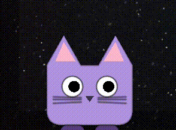

# Claudario: Your terminal's favourite sidekick.

[](LICENSE)
[](#requirements)
[](#requirements)
[](https://swift.org)
[](https://dotnet.microsoft.com)
[](#contributing)

**Claudario is open source under the [MIT License](LICENSE).** Issues
and pull requests are welcome — see [Contributing](#contributing).

<video src="https://github.com/user-attachments/assets/d0f9ec77-b258-426c-a48c-d87bc71d1478" width="100%" autoplay loop muted playsinline>
</video>
<video src="https://github.com/user-attachments/assets/7e2b1b29-7870-4d52-8aaa-651d777d2762" width="100%" autoplay loop muted playsinline>
</video>

Claudario is a lightweight desktop mascot that brings the internal state of Claude Code to life. Instead of checking your terminal for progress, just look at your Dock (macOS) or taskbar (Windows). Claudario walks, jumps, and reacts in real-time to your development workflow, chirping with a chime when a task is done, and bouncing playfully when Claude needs your input. It's a bit of personality for your workspace that keeps you informed without the context-switching.

---

## Meet the crew

<p align="center">
  
</p>

<p align="center">
  <sub>
    <b>Classic</b> · <b>Egg</b> · <b>Cat</b> · <b>Dog</b> · <b>Owl</b> · <b>Panda</b> · <b>Robot</b><br>
    Seven hand-drawn silhouettes, each with their own ears, snouts, beaks, antennas, and quirks.<br>
    Cycle through them on the fly with <kbd>v</kbd> in interactive mode — your pick persists across launches.
  </sub>
</p>

---

## Table of contents

1. [What you get](#what-you-get)
2. [Requirements](#requirements)
3. [Build & first run](#build--first-run)
4. [Setting up Claude Code integration](#setting-up-claude-code-integration)
5. [Interactive mode (click to control)](#interactive-mode-click-to-control)
6. [Petting](#petting)
7. [Dino-runner mini-game](#dino-runner-mini-game)
8. [Making it default for every Claude session](#making-it-default-for-every-claude-session)
9. [Architecture](#architecture)
10. [How it connects to Claude Code (hooks)](#how-it-connects-to-claude-code-hooks)
11. [Event → animation state machine](#event--animation-state-machine)
12. [HTTP protocol on the wire](#http-protocol-on-the-wire)
13. [File / directory layout](#file--directory-layout)
14. [Security model](#security-model)
15. [Customization](#customization)
16. [Troubleshooting](#troubleshooting)
17. [Uninstall](#uninstall)
18. [Limitations](#limitations)
19. [Contributing](#contributing)
20. [License](#license)

---

## What you get

- Menu-bar app on macOS (`LSUIElement = true`), system-tray app on Windows — no Dock or taskbar button in either case.
- Transparent, click-through overlay window pinned to the Dock area (macOS) or taskbar strip (Windows). Strip height is 2× the Dock/taskbar height to give the mascot headroom for jumps and tall activity props.
- Procedurally-drawn mascot:
  - **Idle** when no Claude session is active — blinks every few
    seconds and glances left/right on a non-metronomic rhythm so it
    doesn't look frozen.
  - **Walks back and forth** while Claude is processing.
  - **Tool-aware activities** — different prop emoji + motion for
    *reading* (`📖`), *coding* (`⌨️`), *running* (`⚡`), *browsing*
    (`🌐`), *planning* (`📋`), *deep thinking* (`💭`), *compacting*
    (`🌀`), and plain *thinking* between tool calls (`❓`). Driven
    by the `tool_name` field on each `PreToolUse` hook.
  - **Jumps + chime** when Claude finishes a turn.
  - **Bounces + tone** when Claude needs permission or asks a question.
- **Interactive mode** — when the mascot is idle, click it and use:
  - **← →** to walk, **↑** to jump with chime, **Esc** to release.
  - **1–0** (number row) to preview each of the 10 activity animations.
  - **`,`/`.`** to shrink/grow the mascot, **`c`** to cycle through
    10 colors, and **`v`** to cycle through 7 mascot variants (Classic,
    Egg, Cat, Dog, Owl, Panda, Robot). Last size, color, and variant
    persist across launches.
- **Pet the mascot** — wag the cursor back-and-forth over the
  mascot's head and it reacts like a real pet: eyes squint into happy
  crescents and the body sways. If it was walking, it stops to enjoy
  the petting and resumes when you let go.
- **Dino-runner mini-game** — press **`g`** while the mascot is in
  controlled-idle to launch a Chrome-style runner inside the taskbar/Dock
  strip. Mascot pinned left, score bottom-right, obstacles in the
  mascot's color. **↑** to jump, **R** to restart, **Esc** to exit.
  High score persists across launches.
- Loopback-only HTTP server (not reachable off-host).
- One-click install / uninstall of Claude Code hooks (with backup of
  your existing `settings.json`).
- Optional Launch at Login.

---

## Requirements

### macOS

- **macOS 13** (Ventura) or newer (`SMAppService` and modern `Network`
  framework features).
- **Swift 5.9+** / Xcode 15+ command line tools (`xcode-select --install`
  is enough — no Xcode app needed to build).
- **Claude Code** installed (`npm i -g @anthropic-ai/claude-code` or
  whichever installation method you use).

### Windows

- **Windows 10** (build 1803 or later) or **Windows 11**, 64-bit.
  `curl.exe` is built into Windows 10 1803+ so no extra tools are needed.
- **.NET 8 SDK** — download from [dot.net](https://dotnet.microsoft.com/download).
- **Claude Code** installed (same as above).

---

## Build & first run

### macOS

```bash
git clone <this-repo> Claudario
cd Claudario
./build.sh
open build/Claudario.app
```

You should see:

1. A small orange square (`🟧`) appear in the menu bar (top right of
   your screen).
2. A small mascot at the bottom of your main display, sitting on top
   of (or in the area of) the Dock.

Click the menu-bar icon to get the menu:

```
Enabled                              ✓
Launch at Login
─────────────────────────────────
Install Claude Code Hooks
Uninstall Claude Code Hooks
─────────────────────────────────
Test: Walk + Jump
Test: Notify
─────────────────────────────────
Show Controls…
About Claudario
─────────────────────────────────
Quit
```

### Windows

```powershell
git clone <this-repo> Claudario
cd Claudario\windows
.\build.ps1
.\Claudario.Windows\bin\Release\net8.0-windows\Claudario.exe
```

You should see:

1. A small orange circle appear in the **system tray** (bottom-right
   notification area). If it's hidden, click the `^` arrow to show
   overflow icons.
2. A small mascot at the bottom of your main display, sitting just
   above the taskbar.

Right-click the tray icon to get the menu:

```
Enabled                              ✓
Launch at Login
─────────────────────────────────
Install Claude Code Hooks
Uninstall Claude Code Hooks
─────────────────────────────────
Test: Walk + Jump
Test: Notify
─────────────────────────────────
Show Controls…
─────────────────────────────────
Quit
```

Try **Test: Walk + Jump** first — the mascot should walk for ~4 seconds
and then jump with a chime. **Test: Notify** does the bounce + tone.
**Show Controls…** opens a dialog listing every key binding for
interactive mode. These verify the renderer and audio path before you
wire up Claude Code.

#### Self-contained single-file build (Windows)

To produce a standalone `.exe` that doesn't need .NET installed on the
target machine:

```powershell
dotnet publish Claudario.Windows\Claudario.Windows.csproj `
    -c Release -r win-x64 --self-contained `
    -p:PublishSingleFile=true
```

Output lands in `Claudario.Windows\bin\Release\net8.0-windows\win-x64\publish\`.

---

## Setting up Claude Code integration

There are two pieces:

1. **The app must be running.** Either launch it manually or enable
   **Launch at Login** from the menu so it starts automatically.
2. **Claude Code hooks must be installed** into your settings file.
   This is done once. Click **Install Claude Code Hooks** from the
   menu (menu-bar on macOS, right-click tray icon on Windows).

That's it. Open a new terminal, run `claude` in any directory, ask it to
do something multi-step (e.g. *"add a function and run the tests"*) and
the mascot will walk while Claude works, bounce when it asks for tool
permission, and jump when it finishes.

> Looking for the toy mode? See
> [Interactive mode (click to control)](#interactive-mode-click-to-control)
> below.

### What "Install Claude Code Hooks" actually does

It's a non-destructive merge into `~/.claude/settings.json`
(macOS/Linux) or `%USERPROFILE%\.claude\settings.json` (Windows):

1. Copies the bundled hook script into `~/.claudario/hook` (macOS —
   a 7-line bash file) or `%USERPROFILE%\.claudario\hook.cmd` (Windows
   — a batch file that calls `curl.exe`).
2. If the settings file already exists, writes a timestamped backup next
   to it (e.g. `settings.json.bak.1715079600`).
3. Adds (or updates) entries under the `hooks` key for these events:
   `UserPromptSubmit`, `PreToolUse`, `PostToolUse`, `Stop`,
   `SubagentStop`, `Notification`, `SessionStart`, `SessionEnd`,
   `PreCompact`. Existing entries you already have are kept.
4. If a previous Claudario entry exists, it's deduplicated, not
   appended (safe to click "Install" multiple times).

The injected entry looks like this on **macOS**:

```json
{
  "hooks": {
    "UserPromptSubmit": [
      {
        "matcher": "*",
        "hooks": [
          { "type": "command", "command": "/Users/you/.claudario/hook" }
        ]
      }
    ]
  }
}
```

And like this on **Windows** (uses `cmd.exe` so Claude Code doesn't
need to know about `.cmd` files):

```json
{
  "hooks": {
    "UserPromptSubmit": [
      {
        "matcher": "*",
        "hooks": [
          { "type": "command", "command": "cmd.exe /c \"C:\\Users\\you\\.claudario\\hook.cmd\"" }
        ]
      }
    ]
  }
}
```

### Verifying the hook is wired up

**macOS:**

```bash
# Confirm the script is there:
cat ~/.claudario/hook

# Confirm settings.json contains your hook command:
grep claudario ~/.claude/settings.json

# End-to-end: run the hook script directly and watch the mascot:
echo '{"hook_event_name":"UserPromptSubmit","session_id":"manual"}' \
  | ~/.claudario/hook
# Mascot should start walking.

echo '{"hook_event_name":"Stop","session_id":"manual"}' \
  | ~/.claudario/hook
# Mascot should jump + chime.
```

**Windows (PowerShell):**

```powershell
# Confirm the script is there:
Get-Content "$env:USERPROFILE\.claudario\hook.cmd"

# Confirm settings.json contains your hook command:
Select-String "claudario" "$env:USERPROFILE\.claude\settings.json"

# End-to-end: send a test event and watch the mascot:
'{"hook_event_name":"UserPromptSubmit","session_id":"manual"}' |
    cmd /c "$env:USERPROFILE\.claudario\hook.cmd"
# Mascot should start walking.

'{"hook_event_name":"Stop","session_id":"manual"}' |
    cmd /c "$env:USERPROFILE\.claudario\hook.cmd"
# Mascot should jump + chime.
```

---

## Interactive mode (click to control)

When the mascot is idle (no Claude session running), it doubles as a
small toy you can drive yourself.

### Entering control

Move the cursor over the mascot and **click**. The app activates and
the window takes keyboard focus. Outside of the mascot's bounding box
the overlay is still fully click-through, so you can still interact
with the Dock / taskbar as normal.

### Key map

| Key                    | Effect                                                       |
| ---------------------- | ------------------------------------------------------------ |
| ← Left                 | Walk left (held = continuous; clamped to overlay)            |
| → Right                | Walk right (held = continuous; clamped to overlay)           |
| ↑ Up                   | Jump + coin chime (auto-repeat ignored)                      |
| Esc                    | Release control → idle                                       |
| **1 2 3 4 5 6 7 8 9 0**| Preview each activity (1=idle, 2=thinking, 3=reading, 4=coding, 5=running, 6=planning, 7=browsing, 8=deep-thinking, 9=compacting, 0=dancing) |
| **`,`**                | Shrink mascot one step (24 → 88 pt range, 8 pt steps)        |
| **`.`**                | Grow mascot one step                                         |
| **c**                  | Cycle to next color in the 10-color palette                  |
| **v**                  | Cycle to next mascot variant (Classic, Egg, Cat, Dog, Owl, Panda, Robot) |
| **g**                  | Start the dino-runner mini-game (only while activity is `idle`) |

Size, color, and variant choices all persist across app launches
(macOS: `UserDefaults`; Windows: Registry `HKCU\Software\Claudario`).

### Releasing control

Control is released — and keyboard focus is dropped — when any of
these happen:

- You press **Esc**.
- You click anywhere outside the mascot (Dock/taskbar, desktop, another app).
- Claude Code fires a hook event that would start walking
  (`UserPromptSubmit` / `PreToolUse`). Claude's activity always wins
  — the mascot returns to its job.

### How it works

While `walking`, the entire overlay window is click-through (macOS:
`hitTest` returns `nil`; Windows: `WS_EX_TRANSPARENT` style is set).
While `idle` or `controlled`, hit-testing is restricted to the mascot's
bounding rect so only that small region grabs mouse events.

To receive keyboard input, the window removes `WS_EX_NOACTIVATE`
(Windows) or flips `canBecomeKey` to `true` (macOS) while in
controlled mode, then restores it on release. A global mouse-down
monitor is installed so clicks elsewhere on the system release control.

---

## Petting

The mascot doubles as a small pet you can interact with hands-on. Move
the cursor back-and-forth over its head a couple of times and it
reacts: eyes squint into happy crescents and the body sways gently
while you keep going. Stop, and the reaction fades within about a
second.

### When it's active

- **Idle** — petting works while the mascot is just being a mascot
  (blinking, glancing, no Claude session in flight).
- **Walking** — if Claude is working and the mascot is walking back
  and forth, petting still triggers; the walk pauses for the duration
  and resumes in the same direction once you stop.
- **Off** during the dino-runner game, controlled mode, and any
  non-idle activity (`thinking`, `coding`, `running`, …). Those run
  their own animations on the body and eyes that would fight the
  petting reaction.

### How the gesture is detected

A continuous "petting level" (0 → 1) builds up while the cursor wags
back-and-forth across the head region: each horizontal direction
reversal inside a sliding 1.5 s window counts toward the gesture, and
once two reversals have stacked up the level ramps in over ≈0.8 s of
sustained wagging. Once you stop (or the cursor leaves the head), the
level decays with a ≈0.35 s half-life, so the visual reaction fades
smoothly instead of snapping off.

The level drives the visuals directly per frame: eye `yScale` shrinks
proportionally, and a small `sin`-based body rotation adds the sway —
no separate state machine to fall out of sync.

---

## Dino-runner mini-game

A tiny side-scrolling runner that lives inside the same overlay strip
as the mascot — no extra window, no Dock icon, just press a key and
play.

### Starting a game

1. Click the mascot to enter controlled mode (you'll see it stop
   blinking and take focus).
2. Press **`g`**. The mascot snaps to the left of the strip, a faint
   ground line appears, the score readout shows up at the bottom-right,
   and obstacles begin scrolling in from the right.

`g` is only accepted while the activity is `idle` — i.e. no Claude
session is running and you haven't selected a preview animation.

### Controls during play

| Key   | Effect                                                      |
| ----- | ----------------------------------------------------------- |
| ↑     | Jump (single jump per landing; auto-repeat ignored)         |
| Space | Jump (alternative)                                          |
| R     | Restart after a collision                                   |
| Esc   | Exit the game and return the mascot to its idle behavior    |

A click anywhere outside the overlay also exits the game.

### Scoring

You earn one point for every obstacle that scrolls past you. The
obstacle gap shrinks and the scroll speed ramps up as your score
climbs (capped so the run stays survivable). Your best run is stored
and shown next to the live score as `SCORE NNN HI NNN`.

### Behavior while Claude is working

If a Claude hook fires mid-game, the mascot does **not** abandon the
game — the latest Claude state is buffered and replayed when you exit,
so the mascot resumes whatever Claude is doing right after you press
**Esc**.

---

## Making it default for every Claude session

Claude Code reads hooks from three locations in order, with later
overriding earlier:

| Scope          | File                            | Applies to                         |
| -------------- | ------------------------------- | ---------------------------------- |
| User (global)  | `~/.claude/settings.json`       | **Every** Claude session you run   |
| Project        | `<project>/.claude/settings.json` | Only sessions in that project      |
| Project local  | `<project>/.claude/settings.local.json` | That project, machine-local |

**Claudario installs into the user-global file**, so once you click
**Install Claude Code Hooks**, every Claude Code session — in any
directory, on any project, on this machine — fires the hooks.

Combined with **Launch at Login**, that gives you a fully default setup:

1. **Menu → Launch at Login** ✓ (so the app starts on every login)
2. **Menu → Install Claude Code Hooks** ✓ (so every `claude` session
   fires events)

After that, you can forget about it — it just works whenever you open
a new terminal and type `claude`.

> **Note (Windows):** Launch at Login writes a registry key
> (`HKCU\SOFTWARE\Microsoft\Windows\CurrentVersion\Run`), so it works
> from any path — you don't need to move the `.exe` to a specific
> location first.

> If you want to **disable** Claudario for a specific project (e.g.
> noisy CI scripts running `claude` in headless mode), drop a small
> `.claude/settings.local.json` in that project that sets the same hook
> events to an empty array. Project-local settings override user
> settings.

---

## Architecture

### macOS

```
┌──────────────────────────────────────────────────────────────────────┐
│ Claude Code  (CLI process you run in a terminal)                    │
│                                                                      │
│   reads ~/.claude/settings.json on launch ──► hooks block            │
│                                                                      │
│   on each event, spawns:                                             │
│     /bin/bash ~/.claudario/hook  <stdin: JSON payload>               │
└────────────────────────┬─────────────────────────────────────────────┘
                         │
                         │  stdin: { "hook_event_name": "...", ... }
                         ▼
┌──────────────────────────────────────────────────────────────────────┐
│ ~/.claudario/hook  (7 lines of bash)                                 │
│                                                                      │
│   PORT=$(cat ~/.claudario/port || echo 47821)                        │
│   curl -m 1 -s -X POST --data-binary @-                              │
│        http://127.0.0.1:$PORT/event   || true                        │
└────────────────────────┬─────────────────────────────────────────────┘
                         │ HTTP POST /event
                         ▼
┌──────────────────────────────────────────────────────────────────────┐
│ Claudario.app                                                        │
│   EventServer (NWListener) → EventRouter → MascotScene (SpriteKit)  │
│   StatusItemController (menu bar) · HookInstaller · SoundPlayer     │
└──────────────────────────────────────────────────────────────────────┘
```

### Windows

```
┌──────────────────────────────────────────────────────────────────────┐
│ Claude Code  (CLI process you run in a terminal)                    │
│                                                                      │
│   reads %USERPROFILE%\.claude\settings.json on launch               │
│                                                                      │
│   on each event, spawns:                                             │
│     cmd.exe /c "%USERPROFILE%\.claudario\hook.cmd"                   │
└────────────────────────┬─────────────────────────────────────────────┘
                         │
                         │  stdin: { "hook_event_name": "...", ... }
                         ▼
┌──────────────────────────────────────────────────────────────────────┐
│ %USERPROFILE%\.claudario\hook.cmd  (5-line batch file)              │
│                                                                      │
│   curl.exe -s -m 1 -X POST --data-binary @-                          │
│       http://127.0.0.1:47821/event   (exit /b 0)                     │
└────────────────────────┬─────────────────────────────────────────────┘
                         │ HTTP POST /event
                         ▼
┌──────────────────────────────────────────────────────────────────────┐
│ Claudario.exe  (.NET 8 WPF)                                         │
│                                                                      │
│   ┌──────────────┐     ┌─────────────┐    ┌────────────────────────┐ │
│   │ EventServer  ├────►│ EventRouter ├───►│ MascotScene (SkiaSharp)│ │
│   │ HttpListener │     │ state +     │    │  state: idle/walking/  │ │
│   │ loopback:    │     │ activity    │    │         controlled/    │ │
│   │ 47821        │     │ per session │    │         playing        │ │
│   └──────────────┘     └─────────────┘    └────────────────────────┘ │
│                                                │                     │
│                                                ▼                     │
│   ┌──────────────────┐    OverlayWindow (WPF, transparent, topmost, │
│   │ MascotSettings   │    WS_EX_TRANSPARENT click-through, WH_MOUSE_LL│
│   │ (Registry:       │    hook for click-to-control)                 │
│   │  HKCU\Software\  │                                               │
│   │  Claudario)      │                                               │
│   └──────────────────┘                                               │
│                                                                       │
│   ┌─────────────────┐    ┌─────────────────────┐                     │
│   │ SoundPlayer     │    │ HookInstaller       │                     │
│   │ (Windows.Media\ │    │ (patches            │                     │
│   │  Chimes.wav,    │    │  settings.json)     │                     │
│   │  Notify.wav)    │    │                     │                     │
│   └─────────────────┘    └─────────────────────┘                     │
│                                                                       │
│   NotifyIcon (system tray) with ContextMenuStrip                      │
└──────────────────────────────────────────────────────────────────────┘
```

### Modules and responsibilities

**macOS (Swift):**

| Source file                              | Job                                                                                  |
| ---------------------------------------- | ------------------------------------------------------------------------------------ |
| `main.swift`                             | Bootstraps NSApplication as `.accessory` and installs `AppDelegate`.                 |
| `AppDelegate.swift`                      | Creates the overlay, server, router, sound player, menu bar; wires their callbacks. |
| `Overlay/DockGeometry.swift`             | Reads `com.apple.dock` defaults + `NSScreen` to compute where the Dock lives.        |
| `Overlay/OverlayWindow.swift`            | Borderless transparent `NSWindow` at `popUpMenu` level; toggles `canBecomeKey` for control mode. |
| `Overlay/OverlayWindowController.swift`  | Re-positions the window; owns the click-to-control lifecycle, key map, and global mouse monitor. |
| `Overlay/InteractiveContentView.swift`   | Hit-tests the mascot region (so the rest stays click-through) and routes mouse / key events.    |
| `Mascot/MascotState.swift`               | `enum MascotState { idle, walking, controlled, playing }`.                           |
| `Mascot/DinoGame.swift`                  | `DinoGameController` — obstacles, score HUD, jump physics, collision; runs while state is `.playing`. |
| `Mascot/MascotActivity.swift`            | `enum MascotActivity` (10 cases) + `prop` emoji, speed multiplier, tool→activity map. |
| `Mascot/MascotPalette.swift`             | 10 named `(body, foot)` color tuples.                                                |
| `Mascot/MascotVariant.swift`             | 7 mascot silhouettes; per-variant body path, eye anchor, and decoration sub-nodes.   |
| `Mascot/MascotScene.swift`               | SpriteKit scene; draws procedurally; supports live size/color/variant/activity changes. |
| `Server/EventServer.swift`               | NWListener bound to `.loopback`, parses minimal HTTP/1.1 POSTs.                      |
| `Server/EventRouter.swift`               | Per-`session_id` state machine; tracks walking + current activity; emits callbacks.  |
| `Settings/MascotSettings.swift`          | `UserDefaults` wrapper for color index + size, with cycle/nudge helpers.             |
| `Audio/SoundPlayer.swift`                | One-line wrapper around `NSSound(named:)`.                                           |
| `MenuBar/StatusItemController.swift`     | Menu-bar `NSStatusItem`; toggles, install/uninstall, tests, **Show Controls…**.      |
| `Install/HookInstaller.swift`            | JSON merge into `~/.claude/settings.json`, with backup and uninstall.                |

**Windows (C# / .NET 8):**

| Source file                              | Job                                                                                  |
| ---------------------------------------- | ------------------------------------------------------------------------------------ |
| `App.xaml.cs`                            | WPF entry point; creates overlay, server, router; wires callbacks; owns NotifyIcon tray menu. |
| `Overlay/OverlayWindow.xaml.cs`          | Transparent topmost WPF window; `WS_EX_TRANSPARENT` click-through; permanent `WH_MOUSE_LL` hook for click-to-control; keyboard routing. |
| `Overlay/TaskbarGeometry.cs`             | `SHAppBarMessage` → taskbar rect; strip height = 2× taskbar height.                 |
| `Mascot/MascotState.cs`                  | `enum MascotState { Idle, Walking, Controlled, Playing }`.                           |
| `Mascot/DinoGame.cs`                     | Data-struct game loop; velocity + gravity integrator; obstacle spawning, collision, HUD. |
| `Mascot/MascotActivity.cs`               | `enum MascotActivity` (10 cases) + prop emoji, speed multiplier, tool→activity map. |
| `Mascot/MascotPalette.cs`                | 10 `(Body, Foot)` `SKColor` tuples.                                                 |
| `Mascot/MascotVariant.cs`                | 7 silhouettes via SkiaSharp `SKPath`; per-variant eye anchor and decoration drawing. |
| `Mascot/MascotScene.cs`                  | Per-frame rendering via `CompositionTarget.Rendering`; all activity animations; petting; game lifecycle. |
| `Server/EventServer.cs`                  | `HttpListener` on `http://127.0.0.1:47821/`; parses body; routes to `EventRouter`.  |
| `Server/EventRouter.cs`                  | Per-`session_id` state machine identical in logic to the Swift version.              |
| `Settings/MascotSettings.cs`             | Registry `HKCU\Software\Claudario` wrapper for color, size, variant, high score.    |
| `Audio/SoundPlayer.cs`                   | `System.Media.SoundPlayer` async playback; uses `C:\Windows\Media\` system sounds.  |
| `Install/HookInstaller.cs`               | JSON merge into `%USERPROFILE%\.claude\settings.json` via `System.Text.Json.Nodes`. |

---

## How it connects to Claude Code (hooks)

Claude Code provides a [hooks system](https://docs.claude.com/en/docs/claude-code/hooks-guide) that fires on key lifecycle events. Each registered hook can spawn an arbitrary shell command and feeds it a JSON payload on stdin.

The events Claudario subscribes to:

| Hook event         | Fires when…                                                       | Used for                                        |
| ------------------ | ----------------------------------------------------------------- | ----------------------------------------------- |
| `SessionStart`     | A `claude` process starts a new session                           | Track session ID                                |
| `UserPromptSubmit` | You submit a prompt                                               | Start walking + activity = `thinking`           |
| `PreToolUse`       | Before each tool call (Read, Bash, Edit, …)                       | Activity = category(`tool_name`)                |
| `PostToolUse`      | After each tool call                                              | Activity = `thinking` (between tools)           |
| `PreCompact`       | Before context compaction (manual or auto)                        | Activity = `compacting` (🌀)                    |
| `Notification`     | Permission prompts, AskUserQuestion follow-ups, idle reminders    | Bounce + tone                                   |
| `Stop`             | Claude finishes a top-level turn                                  | Jump + chime                                    |
| `SubagentStop`     | A spawned subagent finishes                                       | Jump + chime                                    |
| `SessionEnd`       | The session terminates                                            | Clear state                                     |

### Tool → activity mapping

| Tool name(s)                                | Activity      | Prop |
| ------------------------------------------- | ------------- | ---- |
| `Read`, `Grep`, `Glob`, `NotebookRead`      | `reading`     | 📖   |
| `Edit`, `Write`, `MultiEdit`, `NotebookEdit`| `coding`      | ⌨️   |
| `Bash`, `BashOutput`, `KillShell`           | `running`     | ⚡   |
| `WebFetch`, `WebSearch`                     | `browsing`    | 🌐   |
| `TodoWrite`, `ExitPlanMode`                 | `planning`    | 📋   |
| `Task` (subagent dispatch)                  | `deepThink`   | 💭   |
| (any other / between tool calls)            | `thinking`    | ❓   |

Mapping lives in `MascotActivity.category(forTool:)` (macOS) /
`MascotActivity.Category(string)` (Windows). Unknown / future tools
fall through to `thinking`.

Two activities never come from hooks — they're test-only previews:

| Activity      | Prop  | Trigger                              |
| ------------- | ----- | ------------------------------------ |
| `compacting`  | 🌀    | `PreCompact` event, **or** key `9`   |
| `dancing`     | 🎉    | key `0` (no hook ever produces this) |

### Why a single script for every event

The hook script is intentionally trivial and must **never block Claude
Code**. Non-zero `PreToolUse` exits would block tool use, so the
script always returns 0 and times out fast (`-m 1`).

**macOS** (`~/.claudario/hook`):

```bash
#!/bin/bash
PORT_FILE="$HOME/.claudario/port"
PORT="$(cat "$PORT_FILE" 2>/dev/null || echo 47821)"
exec curl -s -m 1 -X POST \
    -H "Content-Type: application/json" \
    --data-binary @- \
    "http://127.0.0.1:$PORT/event" >/dev/null 2>&1 || true
```

**Windows** (`%USERPROFILE%\.claudario\hook.cmd`):

```bat
@echo off
curl.exe -s -m 1 -X POST http://127.0.0.1:47821/event ^
  -H "Content-Type: application/json" ^
  --data-binary @- 2>nul
exit /b 0
```

Both scripts share the same properties: 1-second timeout, silent
failure, always return 0. `curl.exe` is built into Windows 10 1803+
so no third-party tools are required.

### Why a port file

The HTTP server tries port `47821` first; if that's already in use, it
falls back to a random ephemeral port assigned by the OS. On macOS the
bash hook reads `~/.claudario/port` so it always finds the server. On
Windows the batch hook currently hardcodes port `47821` — if you need
to run two instances or the port is taken by another app, change
`preferredPort` in `EventServer.cs`.

---

## Event → animation state machine

`EventRouter` keeps a dictionary keyed by `session_id`:

```
struct SessionState { isWalking: bool; lastSeen: DateTime }
sessions: Dictionary<string, SessionState>
```

Transitions:

| Event                             | Effect on `sessions[id]`        | Mascot side-effect                                        |
| --------------------------------- | ------------------------------- | --------------------------------------------------------- |
| `SessionStart`                    | create entry, `isWalking=false` | none                                                      |
| `UserPromptSubmit`, `PreToolUse`  | `isWalking=true`                | If no session was walking before → call `onWalk()`        |
| `PostToolUse`                     | refresh `lastSeen`              | none                                                      |
| `Notification`                    | refresh `lastSeen`              | `onNotify()` (does not change walk state)                 |
| `Stop`, `SubagentStop`            | `isWalking=false`               | If no session is still walking → `onIdle()` + `onCelebrate()` |
| `SessionEnd`                      | remove entry                    | If no session is still walking → `onIdle()`               |

Sessions idle for >5 min are auto-evicted to handle the case where
`SessionEnd` doesn't fire (e.g. the user kills the Claude process).

Concurrent sessions are handled correctly: walking persists as long as
**at least one** session is in flight. The celebration only fires when
**all** sessions have stopped.

---

## HTTP protocol on the wire

The smallest thing that could possibly work — identical on both platforms:

- **Method**: `POST` (any path; we don't even check it).
- **Body**: the JSON payload Claude Code piped to the hook script.
- **Response**: `204 No Content`.

```
POST /event HTTP/1.1
Host: 127.0.0.1:47821
Content-Type: application/json
Content-Length: 79

{"hook_event_name":"UserPromptSubmit","session_id":"abc","cwd":"/Users/me/x"}
```

```
HTTP/1.1 204 No Content
Content-Length: 0
Connection: close
```

The macOS server is hand-rolled in `EventServer.swift` (~90 lines of
`NWListener`). The Windows server uses `HttpListener` from the .NET
BCL, which handles HTTP framing natively. Both parse `Content-Length`
from the headers and route the body to `EventRouter`.

---

## File / directory layout

### In your home directory

**macOS:**

```
~/.claudario/
├── port                # plain-text decimal port number
└── hook                # bash bridge installed by HookInstaller

~/.claude/
├── settings.json                  # your Claude Code config (we patch this)
└── settings.json.bak.<timestamp>  # automatic backup before each install
```

**Windows:**

```
%USERPROFILE%\.claudario\
├── hook.cmd            # batch bridge installed by HookInstaller

%USERPROFILE%\.claude\
├── settings.json                  # your Claude Code config (we patch this)
└── settings.json.bak.<timestamp>  # automatic backup before each install
```

### In the repo

```
Claudario/
├── Package.swift              # macOS: SwiftPM manifest (no dependencies)
├── Info.plist.template        # macOS: Bundle plist (LSUIElement=true, etc.)
├── build.sh                   # macOS: swift build → assemble .app bundle
├── claudario-hook             # macOS: bash bridge (gets bundled into .app)
├── README.md
├── Sources/Claudario/         # macOS Swift source
│   ├── main.swift
│   ├── AppDelegate.swift
│   ├── Overlay/
│   ├── Mascot/
│   ├── Server/
│   ├── Settings/
│   ├── Audio/
│   ├── MenuBar/
│   └── Install/
└── windows/                   # Windows C# source
    ├── build.ps1              # dotnet build → Claudario.exe
    ├── claudario-hook.cmd     # batch bridge (copied to output dir)
    ├── Claudario.Windows.sln
    └── Claudario.Windows/
        ├── Claudario.Windows.csproj
        ├── App.xaml(.cs)
        ├── Overlay/
        │   ├── OverlayWindow.xaml(.cs)
        │   └── TaskbarGeometry.cs
        ├── Mascot/
        │   ├── DinoGame.cs
        │   ├── MascotActivity.cs
        │   ├── MascotPalette.cs
        │   ├── MascotScene.cs
        │   ├── MascotState.cs
        │   └── MascotVariant.cs
        ├── Server/
        │   ├── EventServer.cs
        │   └── EventRouter.cs
        ├── Settings/
        │   └── MascotSettings.cs
        ├── Audio/
        │   └── SoundPlayer.cs
        └── Install/
            └── HookInstaller.cs
```

### Build outputs

**macOS:**

```
.build/release/Claudario        # raw executable (SwiftPM)
build/Claudario.app/            # assembled .app bundle (build.sh output)
    Contents/
    ├── Info.plist
    ├── MacOS/Claudario
    └── Resources/claudario-hook
```

**Windows:**

```
windows/Claudario.Windows/bin/Release/net8.0-windows/
├── Claudario.exe
├── Claudario.dll
├── claudario-hook.cmd          # copied from windows/ by build
└── SkiaSharp.dll, ...          # runtime dependencies
```

---

## Security model

- **Loopback-only listener**: the socket is bound exclusively to
  `127.0.0.1` (macOS: `params.requiredInterfaceType = .loopback`;
  Windows: `HttpListener` prefix `http://127.0.0.1:`). Other machines
  on your network cannot reach it.
- **No authentication**: the server accepts any local POST. The
  threat model is essentially "a process running on your machine could
  send events", which is fine — the worst that happens is a spurious
  mascot animation.
- **Minimal file writes**: the only files Claudario touches are
  `~/.claudario/{port,hook}` (macOS) or `%USERPROFILE%\.claudario\hook.cmd`
  (Windows), and the `settings.json` patch (with backup).
- **Hook script runs in your shell environment** and its only outbound
  action is `curl` to `127.0.0.1`.
- **No network access** from the app itself: no outbound HTTP, no
  cloud service.
- **Windows Registry**: Claudario reads/writes only
  `HKCU\Software\Claudario` (settings) and
  `HKCU\SOFTWARE\Microsoft\Windows\CurrentVersion\Run` (Launch at Login).
  No elevated/admin permissions are required.

---

## Customization

### Activity / palette / size

Activities live in `MascotActivity.swift` (macOS) or `MascotActivity.cs`
(Windows) — edit the `prop` emoji, speed multiplier, or tool category
map there. The 10 colors are in `MascotPalette.*`; size range (24–88 pt,
step 8) is in `MascotSettings.*`.

### Adding new mascot variants

`MascotVariant.swift` / `MascotVariant.cs` define each silhouette.
To add a variant:

1. Append a case to the `MascotVariant` enum and to `displayName` (or
   `AllCases` on Windows).
2. Add a `case` in `bodyPath(size:)` / `BuildPath(float)` that returns
   a path. Keep the path's lowest point at `y = 0` and centered on
   `x = 0`.
3. Add an `eyeY(size:)` / `EyeY(float)` entry to anchor the eyes.
4. (Optional) Add decoration drawing to `buildDecorations` /
   `DrawDecorations` for whiskers, ears, antennas, etc.

### Sounds

**macOS** — edit `SoundPlayer.swift`:

```swift
case .coin:   name = "Glass"   // try "Hero", "Tink", "Submarine"
case .notify: name = "Funk"    // try "Pop", "Blow", "Sosumi"
```

System sounds live at `/System/Library/Sounds/`.

**Windows** — edit `SoundPlayer.cs`:

```csharp
private static readonly string CelebrateFile =
    FindSound("Windows Chimes.wav", "Windows Ding.wav", "chimes.wav");
private static readonly string NotifyFile =
    FindSound("Windows Notify.wav", "Windows Balloon.wav", "notify.wav");
```

System sounds live at `C:\Windows\Media\`. To use a custom `.wav`,
pass its full path to `new System.Media.SoundPlayer(path)`.

---

## Troubleshooting

### I don't see the mascot (macOS)

1. Confirm the app is running: `pgrep -fl Claudario`.
2. Confirm the menu-bar icon is there (top-right corner).
3. From the menu, click **Test: Walk + Jump**. If nothing happens, the
   overlay window is the problem.
4. If the Dock is on the left or right, Claudario falls back to a fixed
   160 pt bottom strip.

### I don't see the mascot (Windows)

1. Confirm the process is running: `Get-Process Claudario -ErrorAction SilentlyContinue`
2. Check the system tray — the icon may be in the overflow (`^`) section.
3. Right-click the tray icon and click **Test: Walk + Jump**. If the
   mascot doesn't appear, the overlay is the problem.
4. The mascot renders just above the taskbar. If your taskbar is set to
   auto-hide, the strip may be very thin — disable auto-hide and try again.
5. Multiple monitors: the mascot pins to the primary monitor (the one
   with the taskbar clock).

### Hooks don't fire when I run `claude` (macOS)

```bash
# 1. Is the bridge installed?
ls -l ~/.claudario/hook

# 2. Are the entries in settings.json?
grep -c claudario ~/.claude/settings.json

# 3. Does the script work standalone?
echo '{"hook_event_name":"Stop","session_id":"x"}' | ~/.claudario/hook
# Mascot should jump.

# 4. Is the app actually listening?
lsof -nP -iTCP:47821 -sTCP:LISTEN
```

### Hooks don't fire when I run `claude` (Windows)

```powershell
# 1. Is the bridge installed?
Test-Path "$env:USERPROFILE\.claudario\hook.cmd"

# 2. Are the entries in settings.json?
(Select-String "claudario" "$env:USERPROFILE\.claude\settings.json").Count

# 3. Does the script work standalone?
echo '{"hook_event_name":"Stop","session_id":"x"}' |
    cmd /c "$env:USERPROFILE\.claudario\hook.cmd"
# Mascot should jump.

# 4. Is the app listening on port 47821?
netstat -ano | Select-String ":47821"
```

If `settings.json` exists but doesn't contain Claudario entries, click
**Install Claude Code Hooks** again. If that fails, the JSON may be
malformed — check for trailing commas.

### Port 47821 is already in use

The server falls back to an ephemeral port. On macOS the hook reads
`~/.claudario/port` automatically. On Windows the batch hook
hardcodes `47821`, so if you need to use a different port, edit
`EventServer.cs` (`preferredPort`) and re-build.

### "Launch at Login" toggle does nothing (macOS)

`SMAppService.mainApp.register()` requires the app to be in
`/Applications` or properly signed. For an ad-hoc dev build in
`build/`, move the `.app` to `/Applications` and try again.

### "Launch at Login" toggle does nothing (Windows)

Registry writes to `HKCU\Run` require no special permissions, so this
should always work. If it doesn't, check that `Environment.ProcessPath`
returns the correct path to `Claudario.exe`.

### Mascot is visible but click-to-control doesn't work (Windows)

The mascot must be in `Idle` state (not `Walking`) for a click to
enter controlled mode. If Claude Code is active, the mascot will be
walking. Wait for Claude to finish, or use **Test: Walk + Jump** from
the tray menu and click the mascot during the ~4 s walk phase.

---

## Uninstall

### macOS

1. Menu bar → **Uninstall Claude Code Hooks** (removes our entries
   from `~/.claude/settings.json`; your other hooks are untouched).
2. Menu bar → **Quit**.
3. (Optional cleanup) `rm -rf ~/.claudario build/Claudario.app`.

### Windows

1. Right-click tray icon → **Uninstall Claude Code Hooks** (removes
   our entries from `%USERPROFILE%\.claude\settings.json`; your other
   hooks are untouched).
2. Right-click tray icon → **Quit**.
3. Disable Launch at Login first if you had it enabled (tray menu →
   **Launch at Login** to uncheck it).
4. (Optional cleanup)
   ```powershell
   Remove-Item -Recurse "$env:USERPROFILE\.claudario"
   Remove-Item -Path "HKCU:\Software\Claudario" -Recurse -ErrorAction SilentlyContinue
   ```

Backups of `settings.json` taken at install time remain at
`settings.json.bak.<timestamp>` until you delete them.

---

## Limitations

### macOS

- **Main screen only** — multi-monitor support is on the to-do list.
  The window pins to `NSScreen.main`.
- **Side-Dock fallback** — if your Dock is on the left or right,
  Claudario draws on a fixed 160 pt (2 × 80 pt fallback) bottom strip
  rather than next to the Dock.
- **macOS 13+** because of `SMAppService`. Backporting to 12 would
  require a `LaunchAgent`-based login launcher.

### Windows

- **Primary monitor only** — the mascot pins to the taskbar of the
  primary display.
- **Port hardcoded in hook.cmd** — unlike the macOS bash hook which
  reads the port from a file, `hook.cmd` always targets port `47821`.
  If that port is taken, re-build with a different `preferredPort` in
  `EventServer.cs`.
- **Taskbar position** — tested with the taskbar at the bottom (default
  Windows layout). Top/side taskbars are handled by `TaskbarGeometry`
  but less thoroughly tested.

### Both platforms

- **Procedural art** — the mascot is drawn with vector paths, not
  sprite-sheet pixel art. Easy to replace; see [Customization](#customization).
- **No preferences UI** — speed, color, sounds, and window level are
  keyboard-only or constants.
- **Interactive mode is idle-only** — by design, you can't take
  keyboard control while Claude is working. Hook activity always
  preempts.

---

## Contributing

Contributions are very welcome. A few ways to help:

- **File an issue** — bug reports, behavior quirks, or feature
  suggestions. Please include your OS version and the output of
  `pgrep -fl Claudario` (macOS) or `Get-Process Claudario` (Windows)
  if it's a "doesn't show up" problem.
- **Send a pull request** — small, focused PRs are easiest to review.
  Good first targets:
  - New mascot variants (add to both `MascotVariant.swift` and `MascotVariant.cs`).
  - New activity animations or tool→activity mappings (both `MascotActivity.*`).
  - Multi-monitor support (see [Limitations](#limitations)).
  - A preferences UI (size/color/variant are keyboard-only on both platforms).
  - Port discovery for `hook.cmd` (read `%USERPROFILE%\.claudario\port`
    like the macOS bash hook does).

### Local development

**macOS:**

```bash
git clone https://github.com/kartikprabhu20/Claudario.git
cd Claudario
./build.sh
open build/Claudario.app
```

**Windows:**

```powershell
git clone https://github.com/kartikprabhu20/Claudario.git
cd Claudario\windows
.\build.ps1
.\Claudario.Windows\bin\Release\net8.0-windows\Claudario.exe
```

When iterating on the mascot, the tray/menu-bar **Test: Walk + Jump**
and **Test: Notify** items are the fastest way to exercise the
animation paths without running a real Claude Code session.

### Code style

Match what's already there — no formatter or linter is enforced. Keep
comments minimal; explain *why* something is the way it is, not *what*
it does.

---

## License

Claudario is released under the [MIT License](LICENSE) — you're free
to use, modify, and redistribute it, including in commercial products.
Attribution is appreciated but not required.
